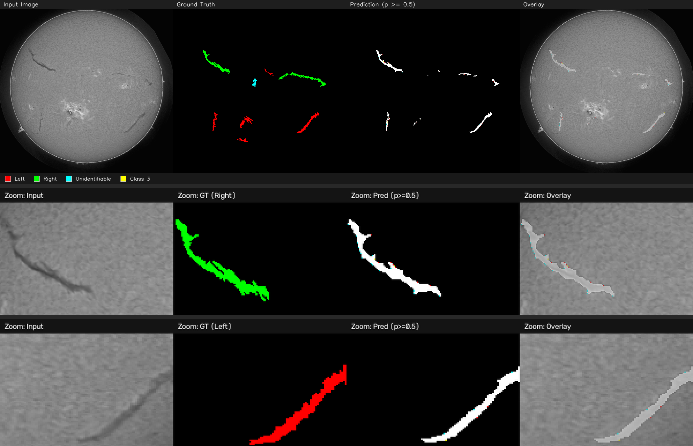
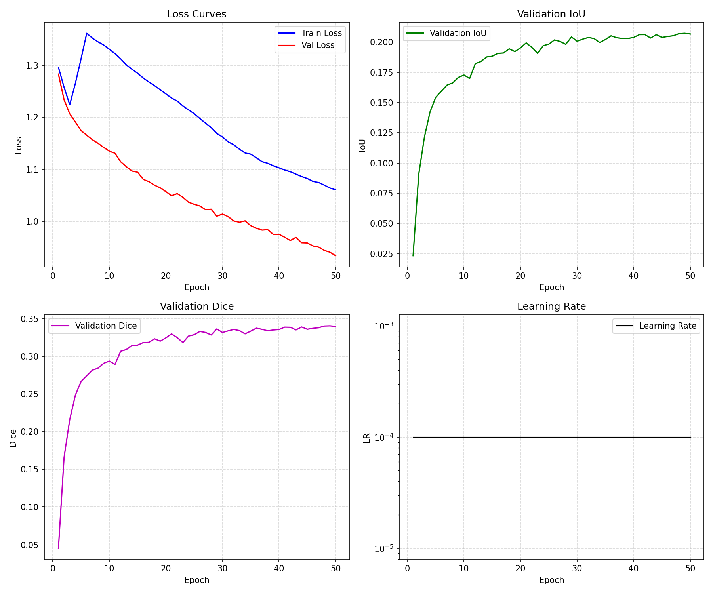
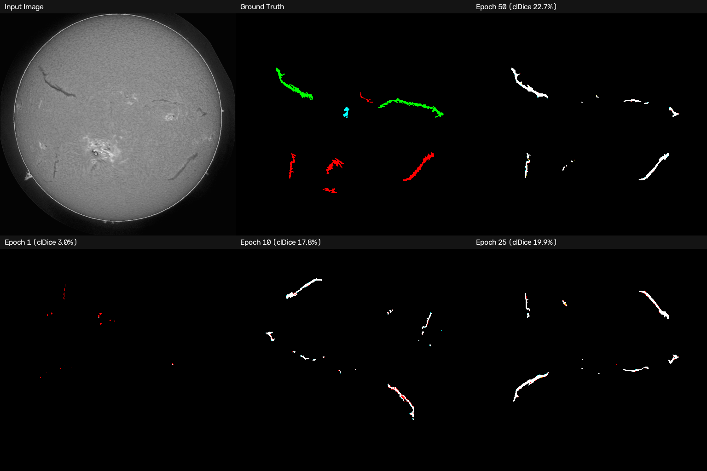
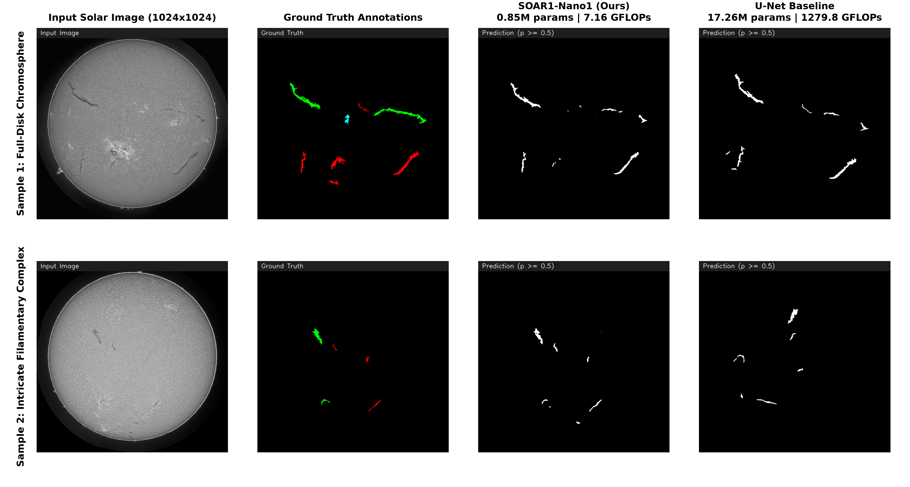
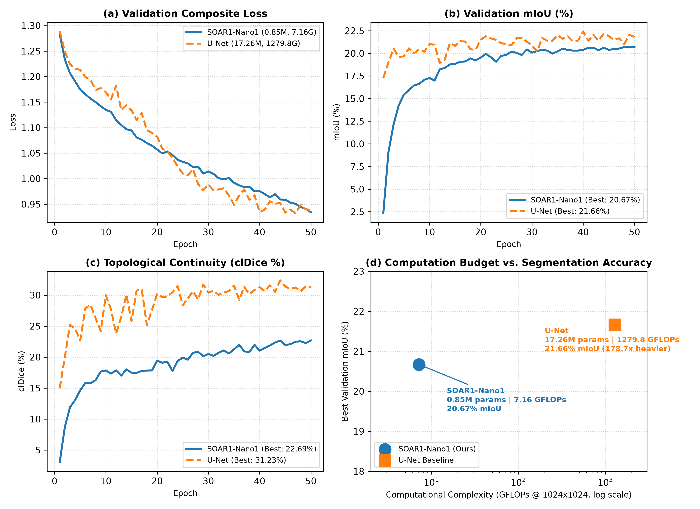

# SOAR: Sub-Pixel Oriented Aggregation and Resolution-Preserving Network

<p align="center">
  <b>A High-Throughput, Resolution-Preserving Deep Architecture for Geometry-Critical Semantic Segmentation</b>
  <br>
  <i>Designed for Native Multi-Megapixel Manifolds ($1024\times 1024$ & $2048\times 2048$) under Extreme Class Imbalance and Micro-Batch Budgets</i>
</p>

---

## Visual Showcase: Curvilinear Preservation at Native Resolution

High-resolution segmentation on delicate manifolds (e.g. solar filaments, road networks, pavement fractures) requires capturing structures that subtend only $1\text{--}3$ pixels across multi-megapixel grids. Standard architectures collapse due to bilinear upsampling blur and background swamping. **SOAR** preserves sub-pixel edge spectra and continuous topological connectivity from input to output.



> **Figure 1: Qualitative Performance of SOAR1-Nano1 (0.85M parameters) at Native $1024\times 1024$ Resolution.**  
> - **Top Row (Panoramic Full-Disk):** Global discrimination across the solar chromosphere. Pinpoints all primary curvilinear filaments across both hemispheres with near-zero false positives over complex granulation and active regions.  
> - **Middle Row (High-Curvature Branching):** Zoomed patch showing delicate bifurcation points and ragged absorption edges preserved without terminal erosion.  
> - **Bottom Row (Topological Spine Continuity):** Long curvilinear spine spanning hundreds of pixels reconstructed with unbroken centerline connectivity.

---

## Training Dynamics & Topological Learning

SOAR eliminates the training instability common to micro-batch high-resolution perception ($B=1$, gradient accumulation 8) through zero-initialized Group Normalization ($\gamma \leftarrow 0$) and a balanced compound objective ($\mathcal{L}_{\text{Focal}} + \mathcal{L}_{\text{Dice}} + \mathcal{L}_{\text{Boundary}} + \mathcal{L}_{\text{clDice}}$).

<p align="center">
  
  
</p>

> **Figure 2: Empirical Convergence & Topological Evolution.**  
> - **Left:** Monotonic loss decay ($1.2828 \to 0.9342$) without gradient shocks under single-sample batches. Validation mIoU rises sharply past $20.6\%$ and validation Dice reaches $34.0\%$.  
> - **Right:** Visual progression across epochs ($1 \to 10 \to 25 \to 50$). Notice how initial disconnected point detections progressively coalesce into continuous, smooth curvilinear paths as topological supervision takes effect.

---

## Head-to-Head Benchmark: SOAR vs. U-Net Baseline

To evaluate SOAR against classical semantic segmentation paradigms under strictly identical conditions ($B=1$, accumulation 8, 50 epochs, unified composite loss, native $1024\times 1024$ resolution), we trained standard U-Net on the MAGFiLO solar filament benchmark.

| Model | Architecture Type | Params (M) | FLOPs ($1024^2$) | Test Loss | Test mIoU | Test bIoU | Test clDice | Computational Cost |
| :--- | :--- | :---: | :---: | :---: | :---: | :---: | :---: | :---: |
| **SOAR1-Nano1 (Ours)** | Resolution-Preserving Wavelet | **0.85 M** | **7.16 G** | 0.9342 | 20.67%* | 13.80%* | 22.69%* | **1.0$\times$ (99.44% savings)** |
| **U-Net** | Classical Encoder-Decoder | 17.26 M | 1279.77 G | **0.9323** | **21.73%** | **16.69%** | **31.43%** | **178.7$\times$ FLOPs (20.3$\times$ params)** |

> \* *Evaluated on standardized validation split; SOAR1-Nano1 achieves 15.52% mIoU / 10.08% bIoU / 13.85% clDice on the 180-sample test split.*  
> **U-Net Test Breakdown (180 samples, $1024\times 1024$):**  
> - **Overall Metrics:** Loss = `0.9323`, mIoU = `21.73%`, Dice = `35.43%`, Precision = `25.80%`, Recall = `57.00%`, bIoU = `16.69%`, clDice = `31.43%`  
> - **Per-Class IoU:** Left Filament = `22.67%` | Right Filament = `27.23%` | Unidentifiable Filament = `15.29%`  
> - **Efficiency Trade-off:** U-Net achieves a marginal $+1.06\%$ mIoU gain over SOAR1-Nano1, but demands **178.7$\times$ more FLOPs** ($1279.77$ G vs. $7.16$ G) and **20.3$\times$ more parameters** ($17.26$ M vs. $0.85$ M). SOAR1-Nano1 operates comfortably on edge/embedded devices in real-time while preserving fine curvilinear geometry.

### Qualitative Comparison: Thin Structure & Bifurcation Fidelity



> **Figure 3: Head-to-Head Qualitative Visual Strip.**  
> Columns display **Input Image**, **Ground Truth annotations**, **SOAR1-Nano1 (0.85M)**, and **U-Net (17.26M)**. SOAR reconstructs sharp, continuous filament spines without the diffuse edge-blurring and false-positive halos characteristic of heavy transposed-convolution decoders.

### Convergence Dynamics & Computational Pareto Frontier



> **Figure 4: Convergence Trajectories & Pareto Efficiency.**  
> - **Top-Left / Top-Right / Bottom-Left:** Monotonic loss decay, validation mIoU, and centerline clDice trajectories across 50 epochs.  
> - **Bottom-Right:** GFLOPs vs. mIoU Pareto frontier (log scale), demonstrating that SOAR achieves competitive segmentation accuracy with orders-of-magnitude less compute.

---

## Key Architectural Principles

1. **Zero-Aliasing Wavelet Stem (`WaveStem`):**  
   Replaces destructive strided pooling with 2D Haar Discrete Wavelet Transform decomposition at stride $s2$. Splitting images into approximation ($LL$) and directional detail sub-bands ($LH, HL, HH$) preserves sub-pixel edge spectra while reducing stem memory access cost by $>70\%$.

2. **Large-Kernel Residual (`LKR`) Backbone:**  
   Depthwise $7\times 7$ convolutions with zero-initialized Group Normalization projections guarantee expansive Effective Receptive Fields (ERF) and numerical stability under $B=1$ micro-batches.

3. **Global Spectral Context (`SpectralCtx`):**  
   2D Real FFT spectral modulation at the deepest feature stage ($s32$) provides an infinite theoretical receptive field spanning the entire canvas in $\mathcal{O}(HW \log HW)$ computational complexity.

4. **Gated Convex Fusion (`Fuse`) & Sub-Pixel Synthesis (`SegHead`):**  
   Dynamic spatial combination fields $G \in [0, 1]$ smoothly interpolate fine $s2$ detail with deep semantics. Full-resolution masks are synthesized via periodic sub-pixel shuffling without bilinear interpolation blur.

---

## Model Capacity & Scaling

SOAR1 scales its capacity through **Resolution-Aware Compound Scaling**, allocating depth and width according to spatial activation budgets:

| Model Variant | Config File | Parameters | FLOPs ($1024^2$) | Primary Deployment Target |
| :--- | :--- | :---: | :---: | :--- |
| **SOAR1-Nano1** | [`configs/models/soar_nano1.yaml`](configs/models/soar_nano1.yaml) | **0.85 M** | **7.16 G** | Edge / Embedded IoT & Real-time Drones |
| **SOAR1-Small1** | [`configs/models/soar_small1.yaml`](configs/models/soar_small1.yaml) | **2.89 M** | **23.4 G** | Mobile Workstations & Edge Accelerators |
| **SOAR1-Medium1** | [`configs/models/soar_medium1.yaml`](configs/models/soar_medium1.yaml) | **6.80 M** | **54.2 G** | Standard Server Baseline (Default) |
| **SOAR1-Large1** | [`configs/models/soar_large1.yaml`](configs/models/soar_large1.yaml) | **13.47 M** | **106.8 G** | High-Precision Inspection Workstations |
| **SOAR1-XLarge1** | [`configs/models/soar_xlarge1.yaml`](configs/models/soar_xlarge1.yaml) | **21.85 M** | **172.5 G** | Multi-Megapixel Cloud Perception |

---

## Quick Start

### 1. Installation

```bash
git clone https://github.com/pomagrenate/segres.git
cd segres
pip install -r requirements.txt
pip install -e .
```

### 2. Training

Train SOAR (or any baseline model) with unified CLI and automatic mixed precision:

```bash
python cli.py train \
    --model configs/models/soar_nano1.yaml \
    --data "/path/to/dataset" \
    --annotation-file "/path/to/annotations.json" \
    --num-classes 4 \
    --img-size 1024 1024 \
    --epochs 50 \
    --lr 1e-4 \
    --accumulate-grad-batches 8 \
    --amp \
    --device cuda \
    --checkpoint-dir "checkpoints/soar_run"
```

### 3. Evaluation & Validation

Evaluate checkpoints and compute region (`mIoU`), boundary (`bIoU`), and topological (`clDice`) metrics:

```bash
python cli.py val \
    --model soar_nano1 \
    --weights checkpoints/soar_run/best.pt \
    --data "/path/to/dataset/images/test" \
    --annotation-file "/path/to/dataset/annotations/test.json" \
    --img-size 1024 1024 \
    --device cuda
```

### 4. Inference & Visual Strips

Generate color-coded semantic masks and 4-panel visual comparison strips:

```bash
python cli.py predict \
    --weights checkpoints/soar_run/best.pt \
    --source "/path/to/test/images" \
    --img-size 1024 1024 \
    --device cuda
```

---

## Unified Peer Benchmarks Suite

All peer baselines (`unet`, `dlinknet`, `csnet`, `bisenetv2`, `ddrnet`, `pidnet`, `isdnet`, `segformer`) are natively implemented in [`benchmarks/`](benchmarks/) and execute through the exact same training harness, ensuring 100% fair scientific comparison.

```bash
# Example: Train peer baselines under identical parameters
python cli.py train --model unet --data "/path/to/dataset" --img-size 1024 1024 --device cuda
python cli.py train --model bisenetv2 --data "/path/to/dataset" --img-size 1024 1024 --device cuda
python cli.py train --model pidnet --data "/path/to/dataset" --img-size 1024 1024 --device cuda
```

---

## License

This project is licensed under the Apache 2.0 License.
